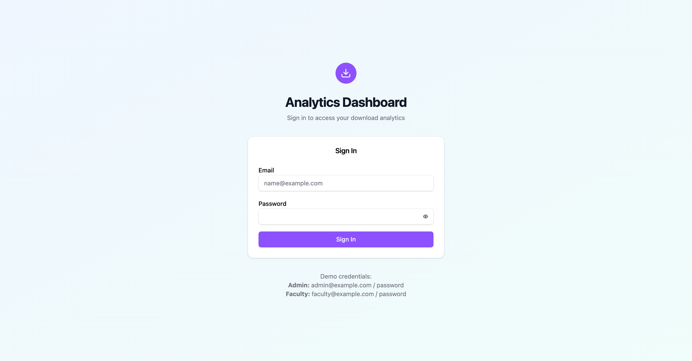
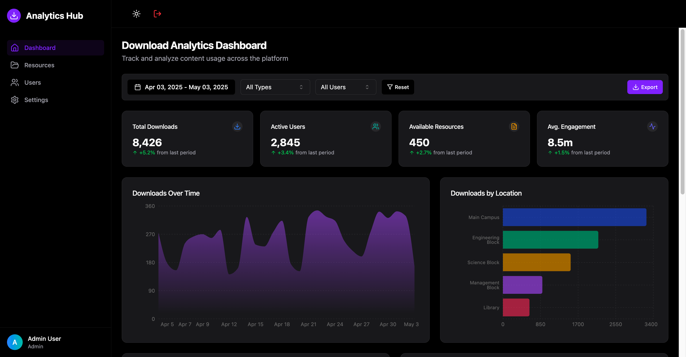
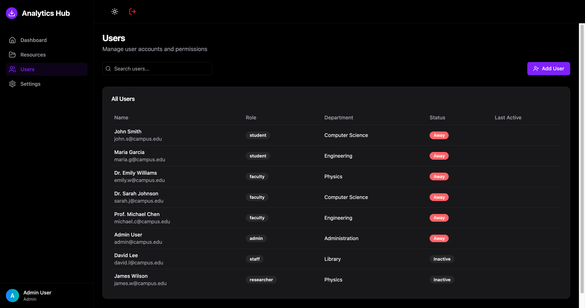
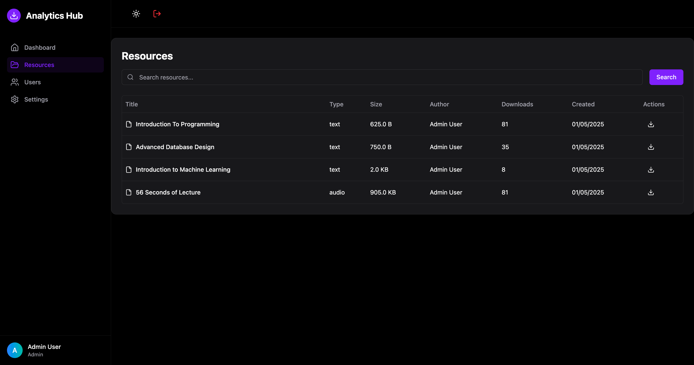
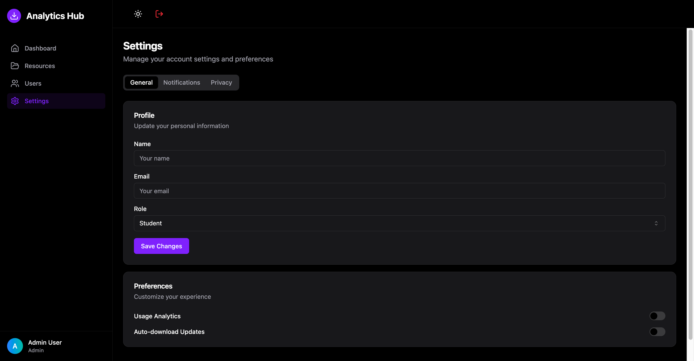

# Download Analytics Dashboard 📊

A modern, full-stack web application for tracking and analyzing file downloads and resource usage.

<!--  -->

[](https://www.typescriptlang.org/)
[](https://reactjs.org/)
[](https://nodejs.org/)
[](https://www.sqlite.org/)

## ✨ Features

- 📈 Real-time download analytics and visualization
- 🗺️ Interactive download map showing geographical distribution
- 📊 Time-series charts for trend analysis
- 👥 User management with role-based access control
- 📁 File upload and management system
- ⚙️ Customizable settings and preferences
- 🔒 Secure authentication and authorization
- 📱 Responsive design for all devices

## 🖼️ Screenshots

<details>
<summary>View Screenshots</summary>

### Dashboard Overview


### User Management


### Resource Analytics


### Settings Panel


</details>

## 🚀 Getting Started

### Prerequisites

- Node.js (v18 or higher)
- Bun package manager

### Installation

1. Clone the repository:
```bash
git clone https://github.com/Rahul-Sahani04/Download-Analytics-Dashboard.git
cd Download-Analytics-Dashboard
```

2. Install dependencies:
```bash
bun install
```

3. Create a .env file in the root directory:
```env
PORT=3000
DATABASE_URL=./analytics.db
JWT_SECRET=your_jwt_secret
```

4. Initialize the database:
```bash
bun run src/backend/db/seed.ts
```

5. Start the development server:
```bash
bun run dev
```

The application will be available at `http://localhost:3000`

## 🏗️ Project Structure

```
src/
├── backend/           # Node.js backend
│   ├── controllers/   # Request handlers
│   ├── db/           # Database configuration
│   ├── middlewares/  # Custom middlewares
│   ├── routes/       # API routes
│   └── types/        # TypeScript definitions
├── components/       # React components
│   ├── dashboard/    # Dashboard-specific components
│   ├── layout/       # Layout components
│   └── ui/          # Reusable UI components
├── pages/           # Main application pages
├── services/        # API service layers
└── types/          # Shared TypeScript types
```

## 🧪 Testing

Run the test suite:
```bash
bun run test
```

## 🛠️ Built With

- **Frontend**
  - React + TypeScript
  - Tailwind CSS
  - Shadcn UI Components
  - React Query
  - Chart.js

- **Backend**
  - Node.js + TypeScript
  - Express.js
  - SQLite
  - JWT Authentication

## 🤝 Contributing

Contributions are welcome! Please feel free to submit a Pull Request.

1. Fork the Project
2. Create your Feature Branch (`git checkout -b feature/AmazingFeature`)
3. Commit your Changes (`git commit -m 'Add some AmazingFeature'`)
4. Push to the Branch (`git push origin feature/AmazingFeature`)
5. Open a Pull Request

## 📝 License

This project is licensed under the MIT License - see the [LICENSE](LICENSE) file for details.

## 🙏 Acknowledgments

- [Shadcn UI](https://ui.shadcn.com/) for beautiful React components
- [Chart.js](https://www.chartjs.org/) for data visualization
- All contributors who have helped with code and documentation